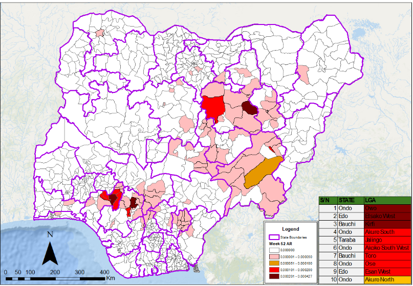

# Map Liberator 🗺️🔓

**Status:** Alpha 🛠️ | **Stack:** R, Shiny, Leaflet, sf

[](https://doi.org/10.5281/zenodo.18325137)

**Map Liberator** is an open-source tool designed to recover spatial data from static images (e.g., PDF Situation Reports, textbook maps, screenshots) by "digitising" them directly into standard administrative boundaries.

It bridges the gap between the previous practice of outbreak reporting (data locked in PDFs) and modern spatial analysis where data underlying visualisations are often shared.

---

## 🚀 Purpose

In public health and epidemiology, valuable data often exists only as static maps in weekly bulletins (e.g., Figure 1). Extracting this data usually requires expensive GIS software or tedious manual entry.



**Map Liberator** addresses this by providing a lightweight, split-screen interface where users can:
1.  **Load** official administrative boundaries (Admin 0, 1, 2) for any country.
2.  **Align** a static reference image (Rotate/Zoom) to match the interactive map.
3.  **Click** regions on the interactive map to "paint" data (Binary, Counts, or Text) based on the image.
4.  **Export** a clean, machine-readable CSV for immediate analysis.

---

## ⚠️ Current Status & Limitations

This project is currently in **Alpha**. It is functional and usable for real-world tasks, but please note:

* **Simplified Geometries:** To ensure browser performance, some administrative boundaries (gadm.org) have been simplified. Very small islands or highly complex coastlines may be generalised.
* **Single-Country Workflow:** The tool is optimised for extracting data one country at a time. To process a multi-country region (e.g., West Africa), simply run the extraction for each country sequentially the data can be combined in the data ledger.
* **Missing Data:** If you find a specific country or administrative level is missing or outdated, please **Open an Issue**.

---

## 📦 Project Structure

The application is built using a modular Shiny architecture for maintainability and scalability.

### Core Application
* **`app.R`**: The entry point. Handles the UI layout, CSS styling (including the robust map resizing logic), and orchestrates the modules.
* **`global.R`**: Handles library loading (`shiny`, `leaflet`, `sf`, `bslib`) and global configuration.

### Modules (`R/`)
* **`mod_map_engine.R`**: The heart of the app. A robust, stateful Leaflet wrapper that handles rendering layers, managing visual hierarchy (line weights), and capturing user clicks without losing state during resizing.
* **`mod_controls.R`**: Manages the sidebar inputs (Country selection, Date entry, Data attribute definition).
* **`mod_sidecar.R`**: Controls the "Reference Map" panel, including image upload and the CSS transform logic for rotation/zooming.
* **`mod_workbench.R`**: The "Ledger." Manages the reactive data table where extracted rows are stored, reviewed, and deleted.
* **`mod_state_manager.R`**: Handles saving (`.rds`) and loading project states, allowing users to pause and resume work.

---

## 💻 Usage Options

### Option 1: Hosted Version (Recommended)
The easiest way to use Map Liberator is via the hosted version on shinyapps.io. This requires no installation or data setup.
* **[Map Liberator on shinyapps.io](https://diddrog11.shinyapps.io/map-liberator/)**

### Option 2: Running Locally
If you prefer to run the app on your own machine (e.g., for data privacy or offline use), follow these steps.

**Note on Data:** Due to GADM license restrictions, this repository does not include the administrative boundary files. You must generate them locally using the provided setup script.

1.  **Clone the Repository**
    ```bash
    git clone https://github.com/diddrog11/map-liberator.git
    ```

2.  **Install Dependencies**
    Open `MapLiberator.Rproj` in RStudio and install the required packages:
    ```r
    install.packages(c("shiny", "shinyjs", "bslib", "leaflet", "sf", "terra", "dplyr", "readr", "shinycssloaders", "geodata"))
    ```

3.  **Generate Spatial Data**
    Run the `setup.R` script found in the root directory. This will:
    * Download the necessary administrative boundaries (GADM) for your target countries.
    * Simplify the geometries for faster rendering.
    * Save the processed `.rds` files into the `data/` folder.
    ```r
    source("setup.R")
    ```

4.  **Run the App**
    ```r
    shiny::runApp()
    ```
---

## 🤝 Contributing

We welcome feedback! If you encounter bugs, especially regarding map rendering or missing administrative units, please use the **Issues** tab.

* **Bug Reports:** Please include the Country and Admin Level you were trying to load.
* **Feature Requests:** Ideas for automation or UI improvements are welcome.

---

*Map Liberator is developed to support open data practices in global health surveillance.*
