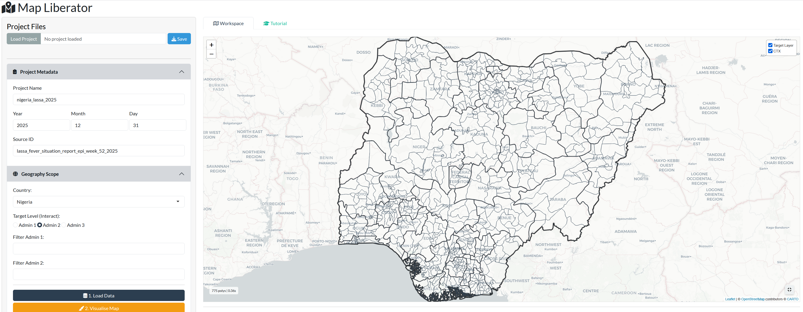
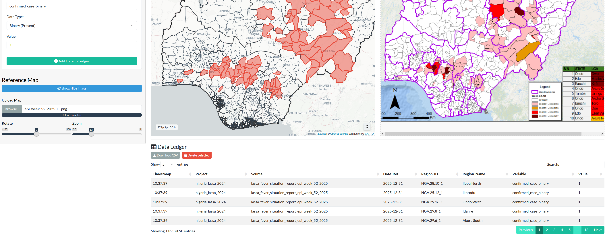
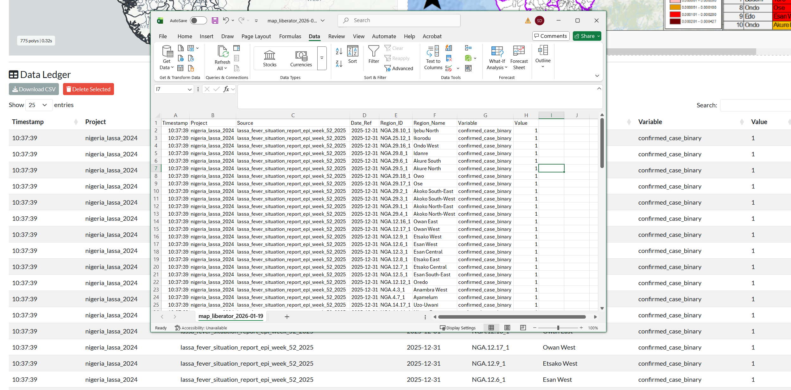

## Introduction

Map Liberator is a tool for extracting data (counts, presence/absence, categories or notes) from static documents such as situation reports, by matching each value to an official administrative boundary. The source can be a map or a table; the output is one tidy ledger either way.

This guide follows one workflow: extracting Lassa fever case data from a [Nigeria NCDC Situation Report](https://ncdc.gov.ng/themes/common/files/sitreps/04beb529df54f4ceb99ac291842640b4.pdf).

---

::: {.tutorial-box}
### 1. Project Management

*Located at the top of the Sidebar.*

* **Load Project:** Upload a previously saved `.rds` file to restore your ledger, your variable schema, the project name and the blank-as-zero setting.
* **Save Project:** Downloads a snapshot of your current work to your browser's download folder. Save every few documents; each save is a new timestamped file.

There is no autosave. Anything not saved is lost when the browser tab closes.
:::

::: {.tutorial-box}
### 2. Project Metadata

*Sidebar Panel 1*

Attached to every row you add to the ledger.

1.  **Project Name:** A name for this extraction task (e.g. `nigeria_lassa_2020`).
2.  **Reference date:** The date the values describe. For a weekly report, one date is enough. For a document covering a longer period, give its first day here and its last day under **Period end**.
3.  **Epi Week:** The epidemiological week printed on the report, recorded separately from the date.
4.  **Source ID:** An identifier for the document (e.g. `lassa_sitrep_2020_w07`).
:::

::: {.tutorial-box}
### 3. Geography Scope

*Sidebar Panel 2*

1.  **Country:** Select the country (e.g. `Nigeria`).
2.  **Target Level:** The administrative level you will enter data against: *Admin 1* (states/provinces), *Admin 2* (districts/LGAs), *Admin 3*.
3.  **Filters (optional):** Restrict to part of the country to make the map faster and less cluttered.
4.  **Actions:** **1. Load Data** processes the boundaries; **2. Visualise Map** draws them; **3. Zoom** recentres.

{width=100%}
*Figure 1: Admin 2 boundaries loaded and ready.*
:::

::: {.tutorial-box}
### 4. The Source Document

*Sidebar "Source Document" section*

The document you are extracting from, shown beside the map or region list.

1.  **Upload:** Select the source file. A **PDF** opens in your browser's own viewer, with page navigation, zoom and search. An **image** (PNG/JPG) can be rotated and zoomed with the sliders and dragged to pan; double-click recentres it.
2.  **Show/Hide Source:** Opens the split-screen view.
3.  **Clock:** A timer starts when a file is uploaded and is stamped on each row you add. Use **Pause clock** when you stop extracting to read or look something up. This is mainly for evaluating the tool; you can ignore it.

The file name is recorded on every row, so name your source files so they identify the document (for example by year and week).

{width=100%}
*Figure 2: The split-screen view, interactive map beside the source.*
:::

::: {.tutorial-box}
### 5. Choosing Regions: Map or List

*Above the main workspace*

Two ways to pick the region a value belongs to; both feed the same ledger.

* **Map:** Click polygons. Best when the source is itself a map.
* **Region list:** A searchable list of the loaded regions by name. Best when the source is a table: type the first letters of the name and click the row. The **Entered** column shows how many values each region already has for the current source document, and the list can be ordered alphabetically or by the order you entered regions in earlier documents.
:::

::: {.tutorial-box}
### 6. Data Extraction

*Sidebar Panel 3*

Choose an **Entry Mode**:

**Paint one value onto selected regions.** For a map where many regions share a value.

1.  Set **Variable Name**, **Data Type** and **Value** (e.g. `presence`, Binary, `1`).
2.  Select the regions on the map or in the list; selected regions turn red.
3.  Click **Add Data to Ledger**.

**Fill in a form for each region.** For a table or labelled map where each region carries several values.

1.  Declare your variables in the **Variables** box, one per line as `name, type`. Types are `count`, `numeric`, `binary`, `ordinal` (with levels, e.g. `band, ordinal, low|mid|high`) and `text`.
2.  Optionally add **Consistency rules** such as `confirmed <= suspected`. An entry that breaks a rule is refused and counted.
3.  Click a region. A form opens with one field per variable. Fill it in and click **Add to Ledger**. Clicking a region that already has values for this document reopens its form pre-filled; submitting replaces the earlier values.

**Empty cells and missing columns.** Tick **Blank numeric fields record as 0** when the source leaves zero cells empty, as most surveillance tables do. Type `NA` into a field when the document does not report that variable at all, so it is recorded as missing rather than zero.

**Which regions to enter.** Our recommendation is to enter only the regions the document reports something for, and to leave the rest out of the ledger. A region with an empty row has not reported anything, and deciding that this means zero is an analysis step, made once and applied consistently, rather than an extraction step typed hundreds of times. Every row in your ledger then corresponds to something printed on the page. When you analyse the data, complete the region-by-period grid yourself, filling zero where the document covered the region and missing where it did not.

{width=100%}
*Figure 3: Selected regions highlighted in red.*
:::

::: {.tutorial-box}
### 7. The Data Ledger

*Below the workspace*

Every value you add is one row: region, variable, value, entry mode, source file and timestamps.

* **Review:** Check that the region name and value match what you intended.
* **Delete:** Select rows and click **Delete Selected**.
* **Download CSV:** Export the ledger for analysis. Values are stored as text so that counts, categories and notes can share one column; convert the count columns to numbers when you reshape the data.

{width=100%}
*Figure 4: The ledger, one row per region per variable.*
:::
